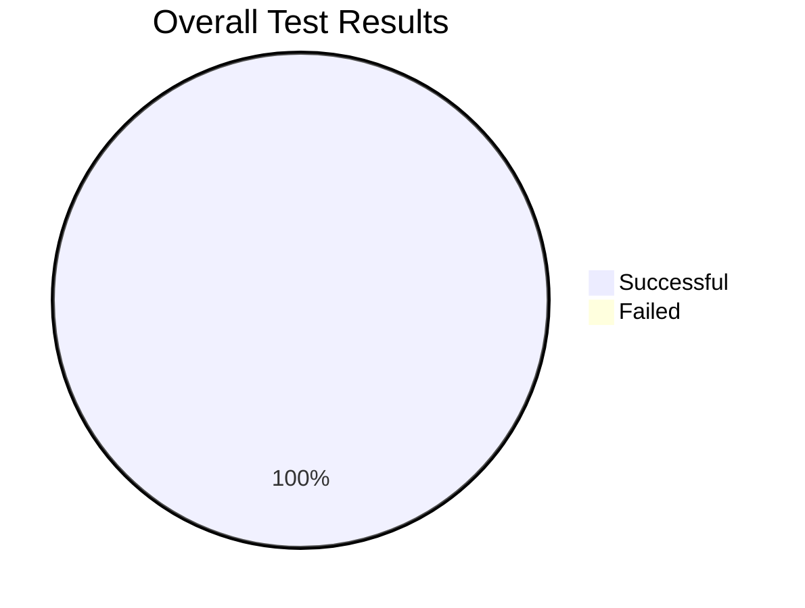
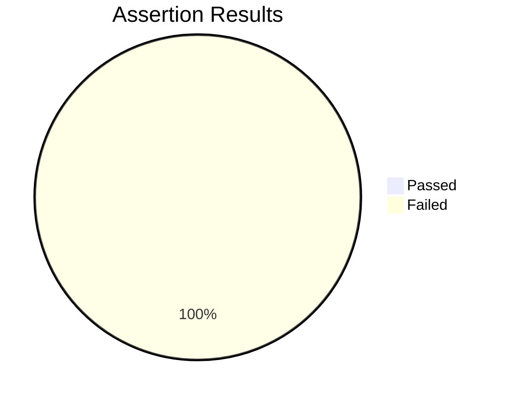
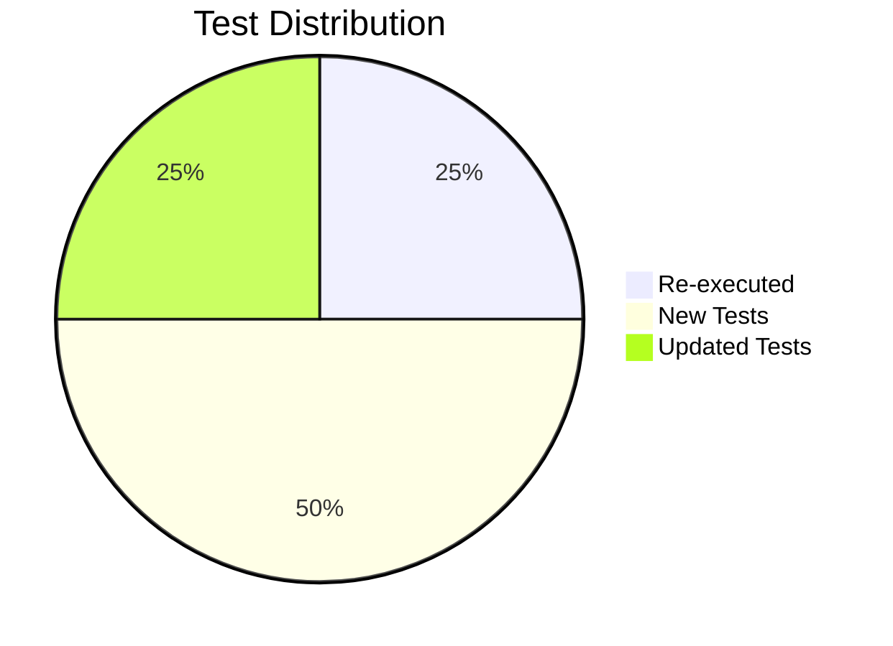
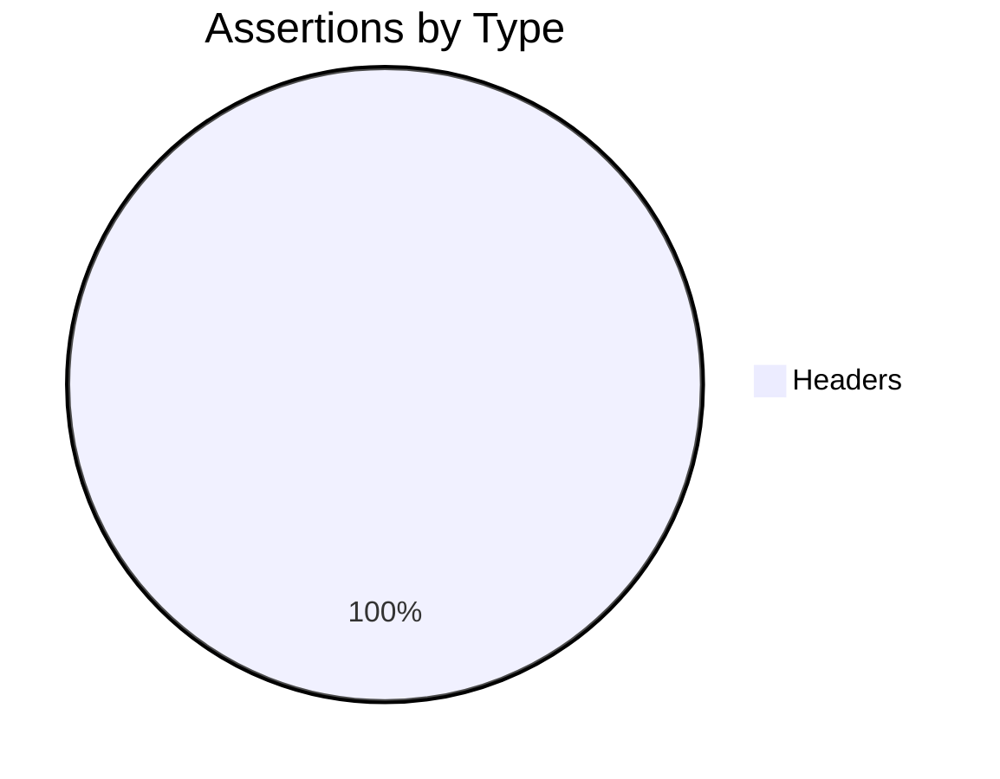
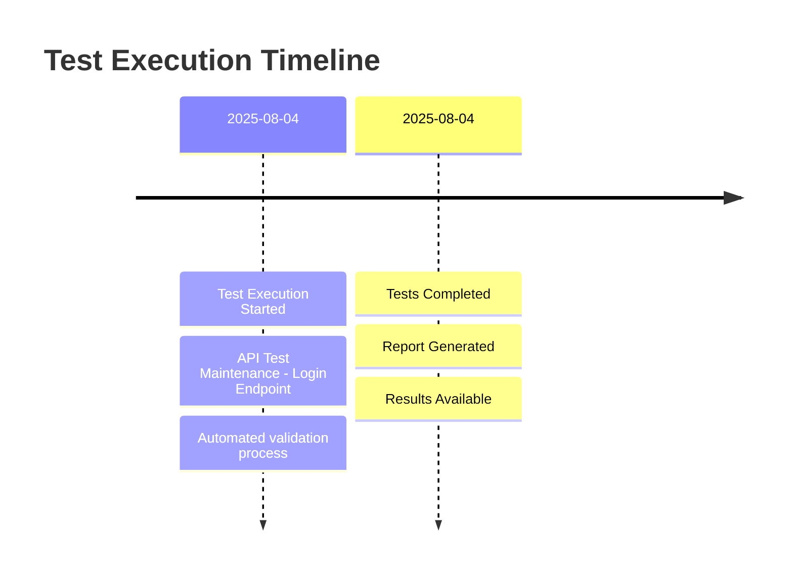

# 🎉 API Test Execution Report

> **EXCELLENT** - 100.0% Success Rate

## 📋 Execution Overview

| | |
|---|---|
| **🆔 Job ID** | `78db1834-c087-465d-92e7-4d359a89e16a` |
| **📝 Execution Name** | API Test Maintenance - Login Endpoint |
| **🔄 Run ID** | `1d39a203-64aa-45f4-96bd-518ecfaa2b19` |
| **⏰ Timestamp** | 2025-08-04 11:20:00 UTC |
| **📊 Overall Status** | 🟢 **EXCELLENT** (100.0% success) |

### 💬 Summary
Update, execute, and clean up login API tests

---

## 📈 Visual Statistics

### Overall Test Success Rate
▰▰▰▰▰▰▰▰▰▰▰▰▰▰▰▰▰▰▰▰▰▰▰▰▰▰▰▰▰▰ 100.0%

**4/4 tests passed**

### Assertion Success Rate
▱▱▱▱▱▱▱▱▱▱▱▱▱▱▱▱▱▱▱▱▱▱▱▱▱▱▱▱▱▱ 0.0%

**0/14 assertions passed** (0.0%)

### Test Distribution by Type

### Assertion Distribution by Type

---

## 📊 Detailed Statistics

<table>
<tr>
<th>📊 Metric</th>
<th>🔢 Count</th>
<th>📈 Success Rate</th>
<th>🎯 Progress</th>
</tr>
<tr>
<td><strong>🔄 Re-executed Tests</strong></td>
<td>1</td>
<td>100.0%</td>
<td>▰▰▰▰▰▰▰▰▰▰▰▰▰▰▰ 100.0%</td>
</tr>
<tr>
<td><strong>🆕 New Tests</strong></td>
<td>2</td>
<td>100.0%</td>
<td>▰▰▰▰▰▰▰▰▰▰▰▰▰▰▰ 100.0%</td>
</tr>
<tr>
<td><strong>🔧 Updated Tests</strong></td>
<td>1</td>
<td>100.0%</td>
<td>▰▰▰▰▰▰▰▰▰▰▰▰▰▰▰ 100.0%</td>
</tr>
<tr style="background-color: #f0f8ff;">
<td><strong>🎯 TOTAL TESTS</strong></td>
<td><strong>4</strong></td>
<td><strong>100.0%</strong></td>
<td><strong>▰▰▰▰▰▰▰▰▰▰▰▰▰▰▰ 100.0%</strong></td>
</tr>
</table>

### 🔍 Assertion Statistics

<table>
<tr>
<th>🧪 Assertion Type</th>
<th>🔢 Count</th>
<th>📈 Success Rate</th>
<th>🎯 Progress</th>
</tr>
<tr>
<td><strong>🏷️ Headers Assertions</strong></td>
<td>14</td>
<td>0.0%</td>
<td>▱▱▱▱▱▱▱▱▱▱▱▱▱▱▱ 0.0%</td>
</tr>
<tr>
<td><strong>📋 Schema Assertions</strong></td>
<td>0</td>
<td>0.0%</td>
<td>▱▱▱▱▱▱▱▱▱▱▱▱▱▱▱ 0%</td>
</tr>
<tr>
<td><strong>🛤️ JSONPath Assertions</strong></td>
<td>0</td>
<td>0.0%</td>
<td>▱▱▱▱▱▱▱▱▱▱▱▱▱▱▱ 0%</td>
</tr>
<tr>
<td><strong>📄 Body Assertions</strong></td>
<td>0</td>
<td>0.0%</td>
<td>▱▱▱▱▱▱▱▱▱▱▱▱▱▱▱ 0%</td>
</tr>
<tr style="background-color: #fff8dc;">
<td><strong>🎯 TOTAL ASSERTIONS</strong></td>
<td><strong>14</strong></td>
<td><strong>0.0%</strong></td>
<td><strong>▱▱▱▱▱▱▱▱▱▱▱▱▱▱▱ 0.0%</strong></td>
</tr>
</table>

---

## 📋 Detailed Test Results

### 🔄 Re-executed Tests (1 tests)

🟢 <strong>Test 1</strong> - Unknown Unknown | Status: 0

**Result:** ✅ PASS  
**API:** `Unknown Unknown`  
**Status Code:** `0`  
**Type:** Re-execution validation

### 🧪 Assertion Results
No assertions available

### 🆕 New Tests Created (2 tests)

🟢 <strong>New Test 1</strong> - /mock-login | Status: 0 | Assertions: 0/5 ✅

**Result:** ✅ PASS  
**API Path:** `/mock-login`  
**Description:** Wrong wrong password [Type: negative, Category: functional]  
**Status Code:** `0`  
**Type:** Newly created test

### 🧪 Assertion Results

**Headers Assertions:**

❌ Headers check 1

- **Type:** 
- **Expected:** `N/A`
- **Actual:** `N/A`
- **Result:** FAIL

❌ Headers check 2

- **Type:** 
- **Expected:** `N/A`
- **Actual:** `N/A`
- **Result:** FAIL

❌ Headers check 3

- **Type:** 
- **Expected:** `N/A`
- **Actual:** `N/A`
- **Result:** FAIL

❌ Headers check 4

- **Type:** 
- **Expected:** `N/A`
- **Actual:** `N/A`
- **Result:** FAIL

❌ Headers check 5

- **Type:** 
- **Expected:** `N/A`
- **Actual:** `N/A`
- **Result:** FAIL

🟢 <strong>New Test 2</strong> - /mock-login | Status: 0 | Assertions: 0/5 ✅

**Result:** ✅ PASS  
**API Path:** `/mock-login`  
**Description:** Verify login fails when SQL injection is attempted in username [Type: negative, Category: functional]  
**Status Code:** `0`  
**Type:** Newly created test

### 🧪 Assertion Results

**Headers Assertions:**

❌ Headers check 1

- **Type:** 
- **Expected:** `N/A`
- **Actual:** `N/A`
- **Result:** FAIL

❌ Headers check 2

- **Type:** 
- **Expected:** `N/A`
- **Actual:** `N/A`
- **Result:** FAIL

❌ Headers check 3

- **Type:** 
- **Expected:** `N/A`
- **Actual:** `N/A`
- **Result:** FAIL

❌ Headers check 4

- **Type:** 
- **Expected:** `N/A`
- **Actual:** `N/A`
- **Result:** FAIL

❌ Headers check 5

- **Type:** 
- **Expected:** `N/A`
- **Actual:** `N/A`
- **Result:** FAIL

### 🔧 Updated Tests (1 tests)

🟢 <strong>Updated Test 1</strong> - /mock-login | Status: 0 | Assertions: 0/4 ✅

**Result:** ✅ PASS  
**API Path:** `/mock-login`  
**Description:** Ensure successful login with valid username and password  
**Status Code:** `0`  
**Type:** Updated test validation

### 🧪 Assertion Results

**Headers Assertions:**

❌ Headers check 1

- **Type:** 
- **Expected:** `N/A`
- **Actual:** `N/A`
- **Result:** FAIL

❌ Headers check 2

- **Type:** 
- **Expected:** `N/A`
- **Actual:** `N/A`
- **Result:** FAIL

❌ Headers check 3

- **Type:** 
- **Expected:** `N/A`
- **Actual:** `N/A`
- **Result:** FAIL

❌ Headers check 4

- **Type:** 
- **Expected:** `N/A`
- **Actual:** `N/A`
- **Result:** FAIL

---

## ⏱️ Execution Timeline

---

## 🔍 Analysis & Recommendations

### ⚠️ Good Tests, But Assertion Issues
- Tests are passing successfully
- However, assertion validation needs attention
- API responses may not match expected format

### 💡 Recommendations
- Review failing assertions for data format changes
- Update assertion expectations if API evolved
- Check for new response fields or changed data types
- Consider assertion maintenance

---

## 🔧 Technical Details

<strong>📋 Execution Metadata</strong>

| Property | Value |
|----------|-------|
| **Generated At** | 2025-08-04 11:20:00 UTC |
| **Report Version** | v2.0 (Enhanced) |
| **System** | QAPI Auto TestGen |
| **Job ID** | `78db1834-c087-465d-92e7-4d359a89e16a` |
| **Run ID** | `1d39a203-64aa-45f4-96bd-518ecfaa2b19` |
| **Total Execution Time** | _Calculated by system_ |
| **Report Format** | Enhanced Markdown with Mermaid |

---

**🤖 This report was automatically generated by the QAPI Auto TestGen system**

*Last updated: 2025-08-04 11:20:00 UTC*

